# CITS3403 Project: Learn Morse
Team Members: Jonathan Choong (22717807), Dean Law Yim Wan (22722049), Nick Hodgskin (22716239)

## Instructions
- Run `pip install -r requirements.txt`
- Run `flask db init`
- Run `flask db migrate`
- Run `flask db upgrade`

## Philosophy
Our philosphy throughout the design process was to create a fun, gamified learning experience to help people learn morse code.

Surprisingly, the websites we found where you can learn morse code turned out to be pretty lack-lustor. Google's website was pretty limited in scope, with no user statistics, and no resources on hand to learn, resulting in no sense of progress. Other websites were either extremely dated, or completely oriented around learning morse from a binary tree.
## Design
We decided to maintain a minimalist design throughout the entirety of our website. This ensured that our website's theme would not detract the user's focus in learning morse code but will provide an engaging and user-friendly experience. 

To achieve this design we decided to maintain :
- Three recurring colours to maintain a consistent theme without introducing too much distraction - navy blue, white, red highlights.
- Flat shapes to promote simplicity - ie. 2D square text boxes, flat transparent buttons, flat unicolour background. 
- Flat icons - 'game' icons on the homepage, learn morse logo in navbar and in footer. 
- Single font style - "Fira Code".
- Cartoon-like implementation to give a gamified theme - ie. cartoon avatars sourced from <a href="https://getavataaars.com/?accessoriesType=Wayfarers&avatarStyle=Transparent&clotheColor=Black&clotheType=CollarSweater&eyeType=Surprised&eyebrowType=RaisedExcited&facialHairColor=Red&facialHairType=Blank&graphicType=Bear&hairColor=Blonde&hatColor=Pink&mouthType=Sad&skinColor=Pale&topType=WinterHat1.">getavataaars website</a>. 
### WireFrame Diagrams
Homepage
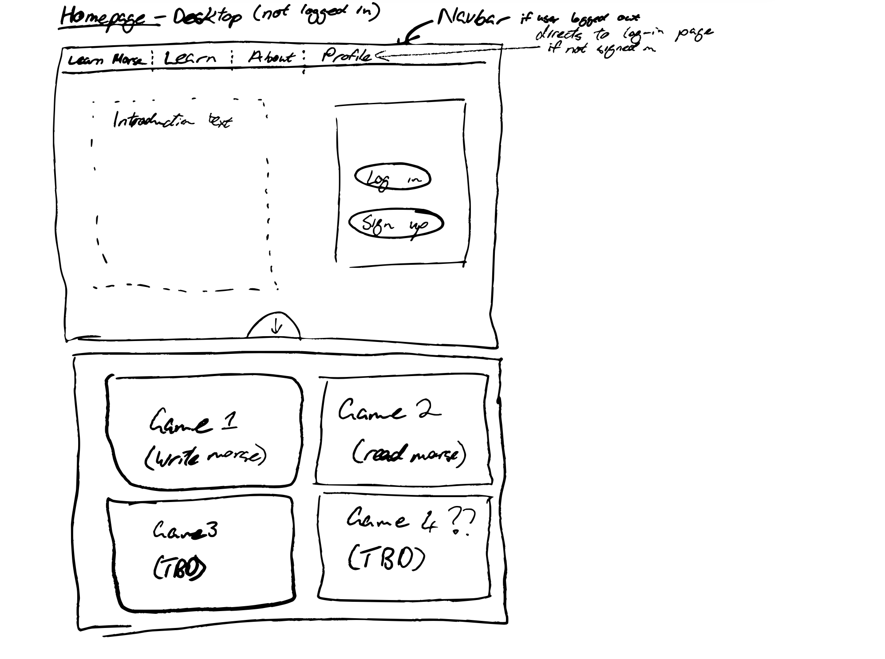
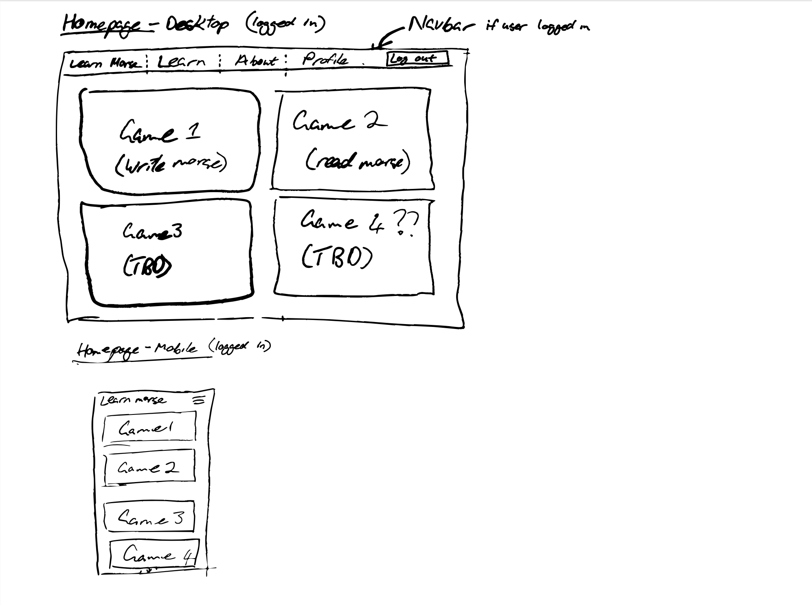
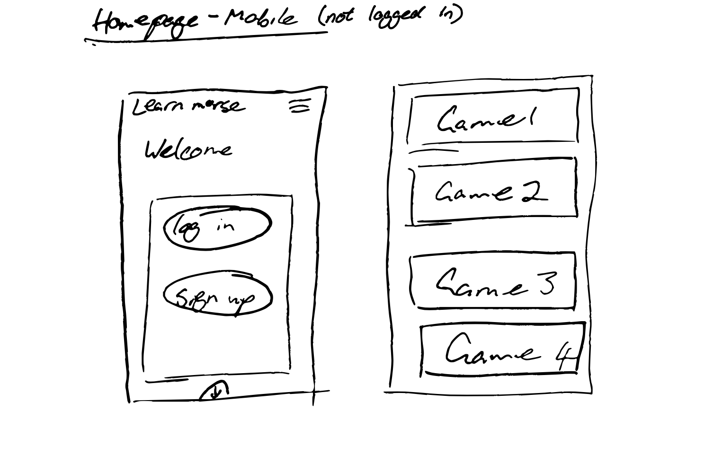
About Page
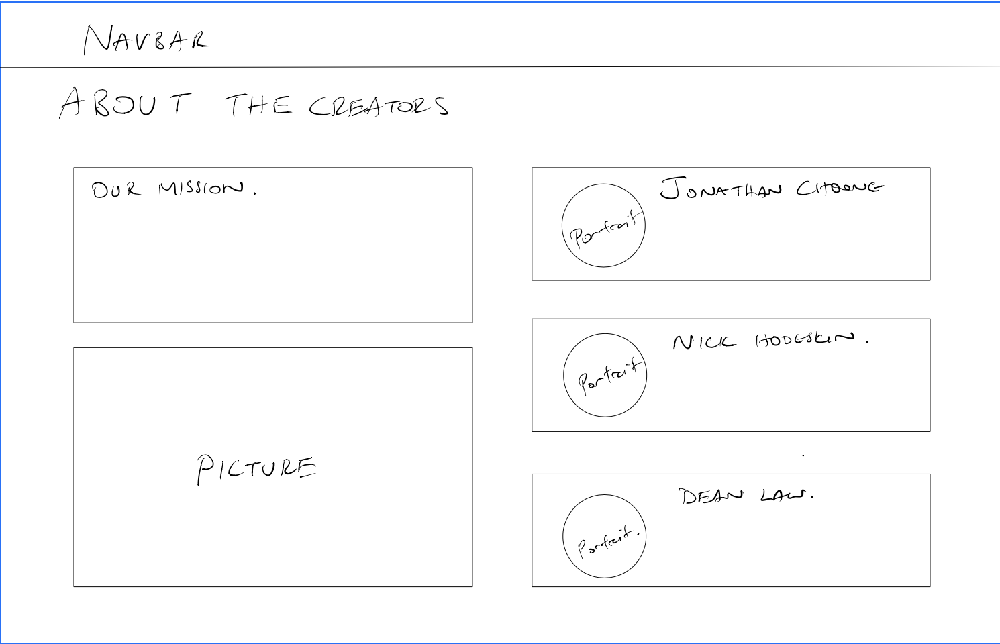
Learn Page
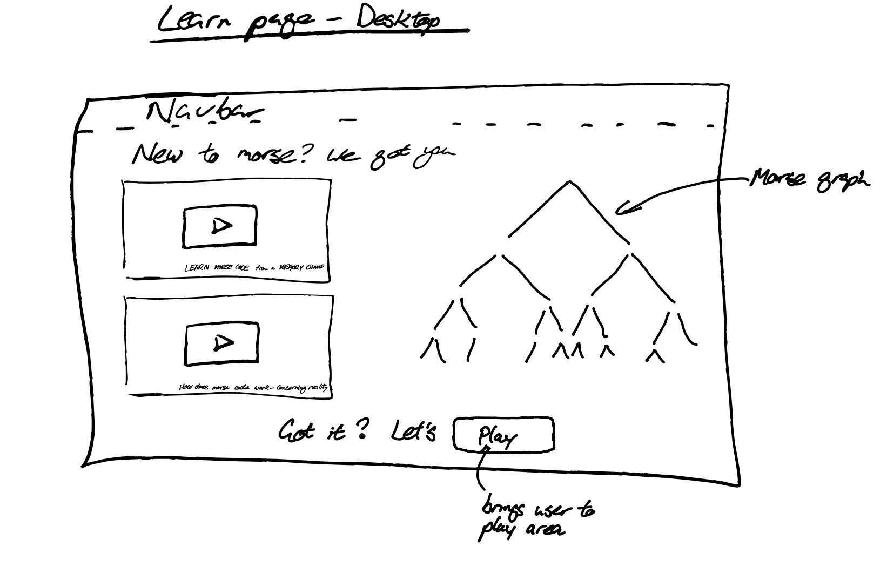
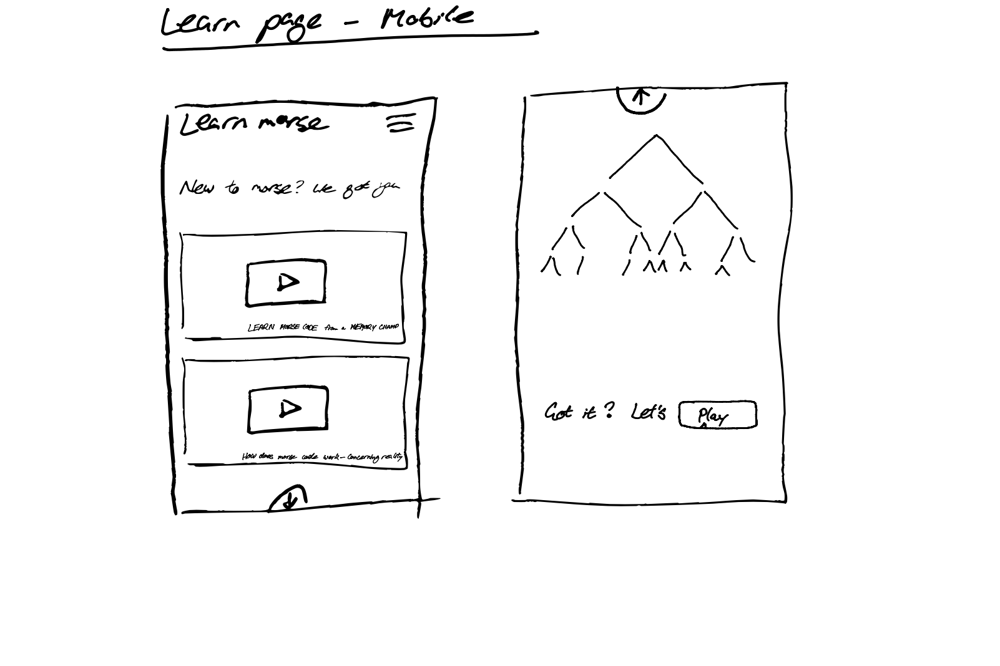
Write Page
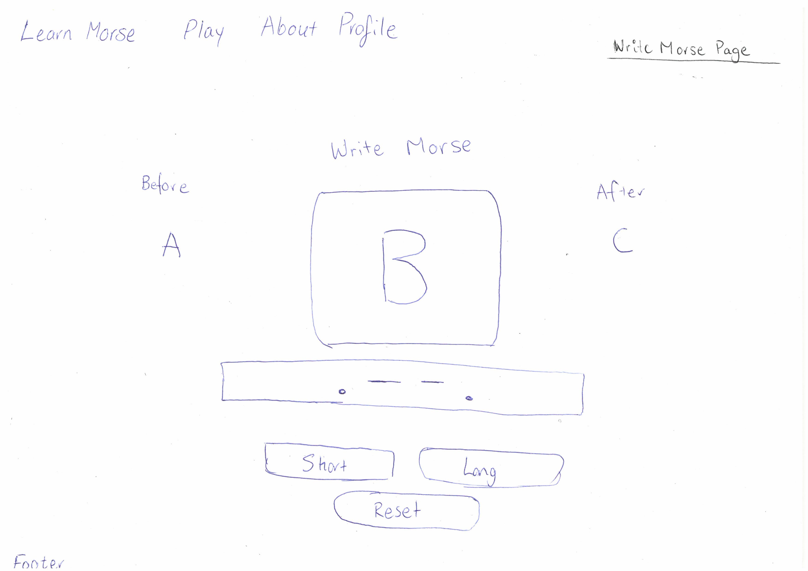
Read Page
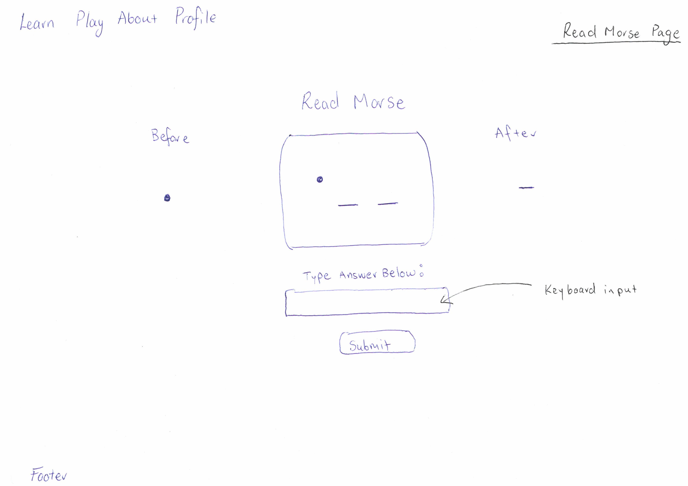
Flashcards Page
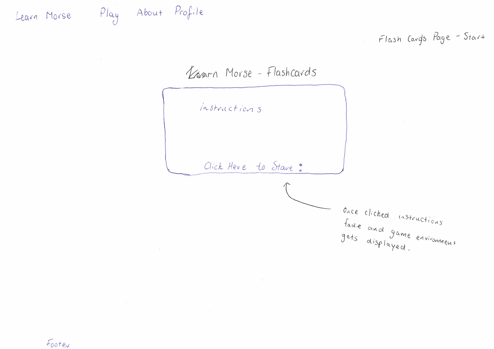
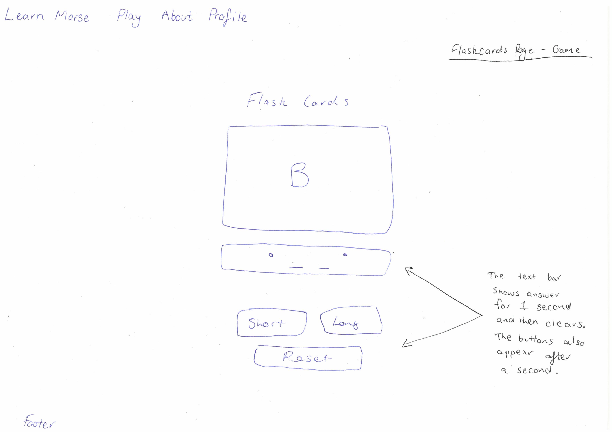
Games on Mobile
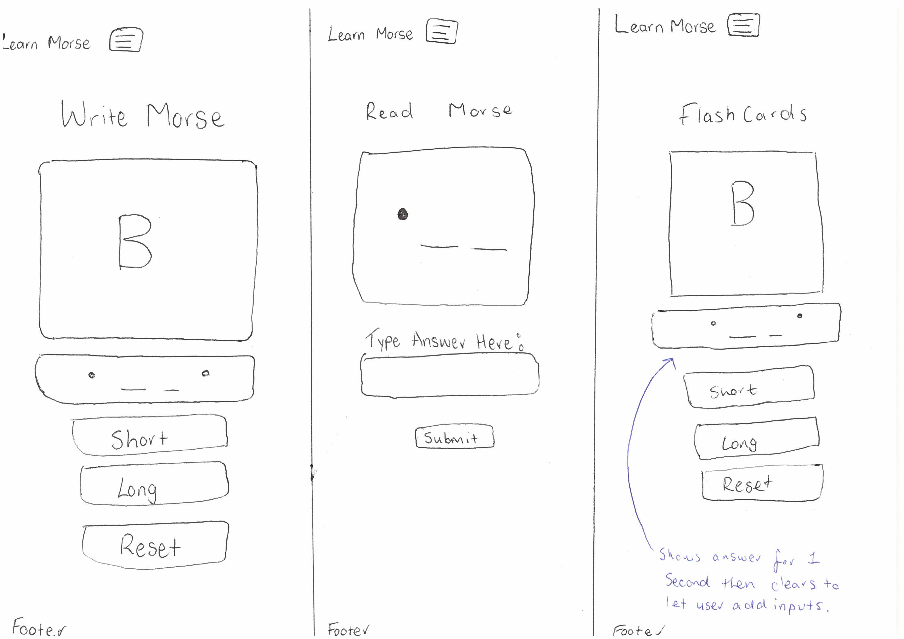
Login and Signup Pages
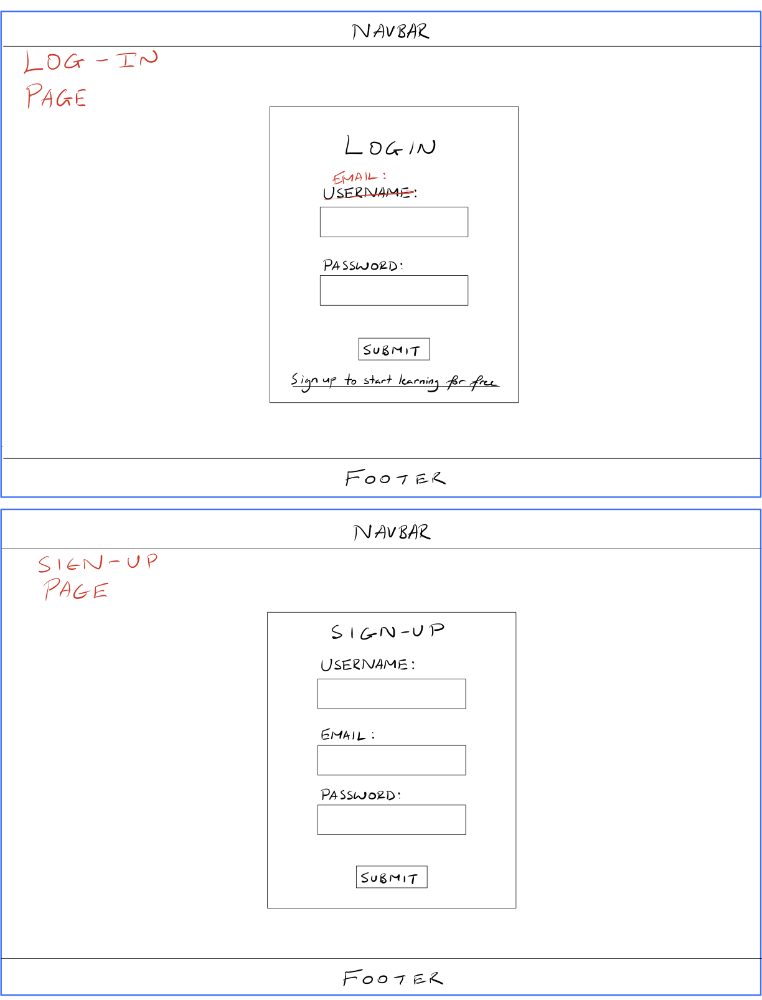
Footer
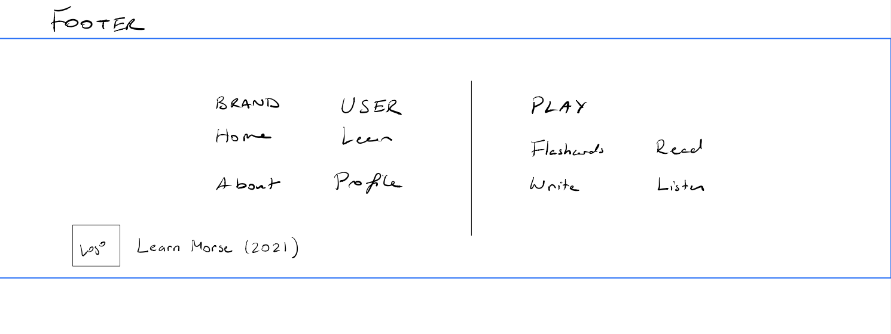

## Development
### Database Schema
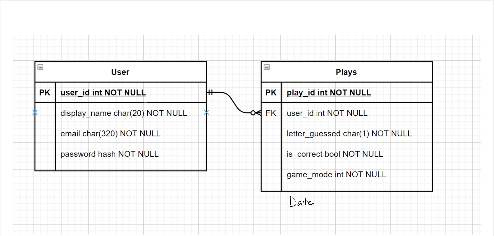
Our website ends up only requiring a simple data schema. We opted to track all the the plays made by users. This approach allows us to customise user statistics down the line if necessary, which wouldn't be possible if we were aggregating data along the way.

### Javascript
As morse code is the central element of the site, it is important to make sure that there is an easy way to convert to and from morse code.
We created a Javascript file that implements a traslator object, which can be used to translate both letters and full sentences to and from morse code.
We also used Javascript in order to create a function that can play the morse code out loud.

## Testing
We implemented database unit testing as well as client side testing using the Selenium IDE.

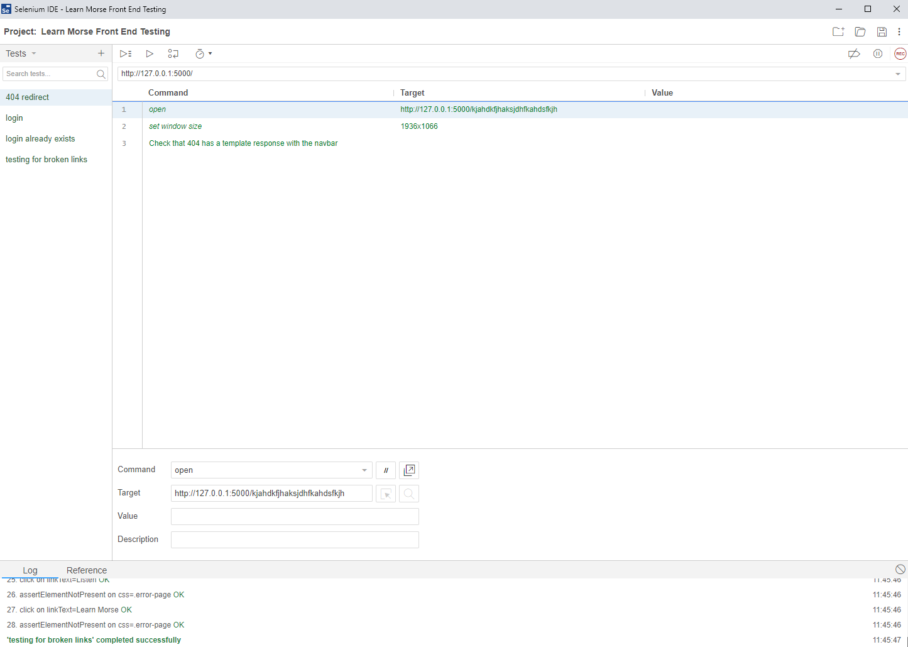

## Security and Data Integrity
We decided to perform the game logic and answer validation on the client-side in order to optimise server performance. As a result, the user is in control of their answers and the responses sent back to the database. This means that if a user really wanted they could cheat and send back a lot of "correct" responses to the database. This, in reality, isn't an issue, as they could also just cheat by having a sheet in front of them. And by cheating, the only person they are cheating is themself, and they will not learn morse. 
